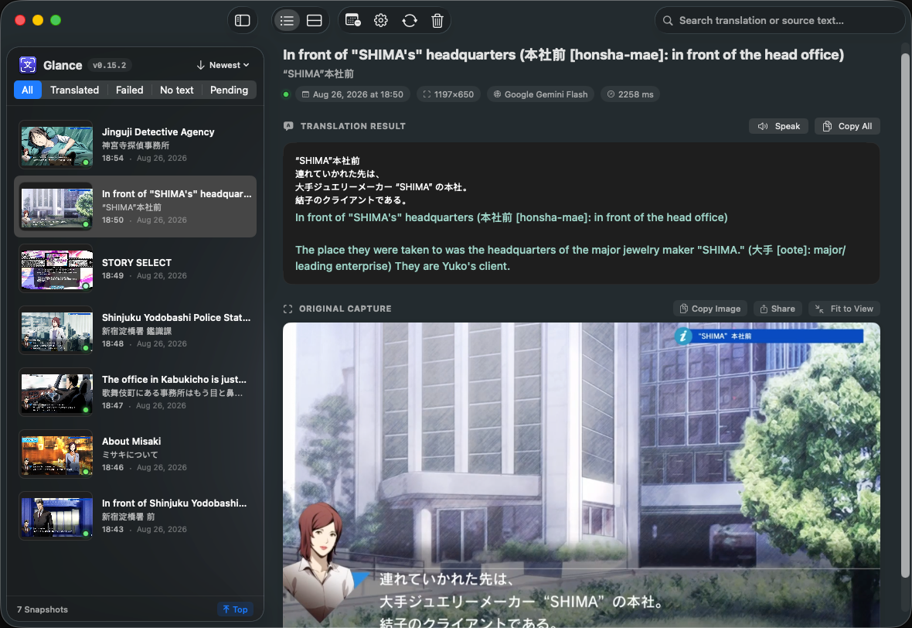
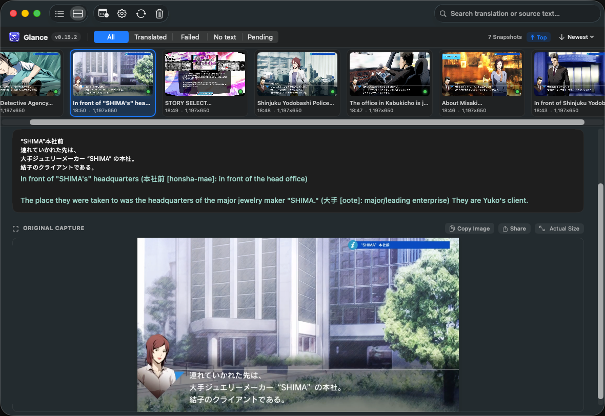
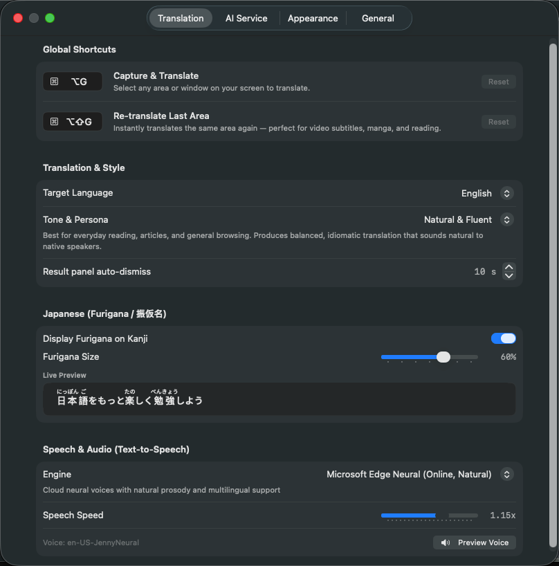
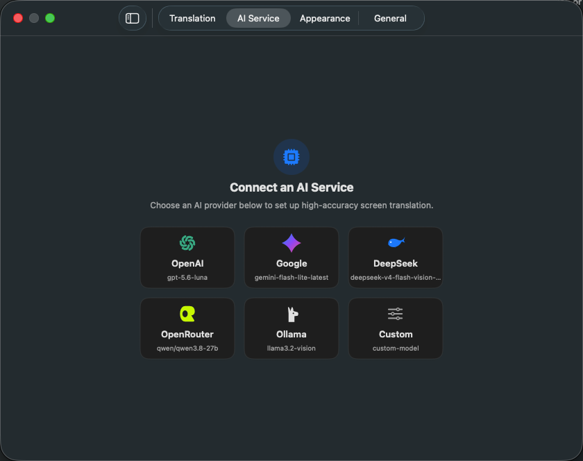
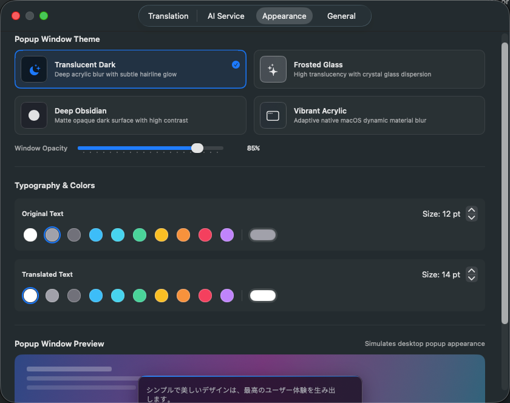

  

<h1 align="center">Glance</h1>

  <strong>Capture anything on your screen. Understand it instantly.</strong>

  
  
  
  
  

---

## Overview

**Glance** is a native macOS menu bar companion for frictionless on-screen translation, OCR, and language comprehension.

Whenever you encounter foreign languages, code snippets, scanned documents, video subtitles, or unselectable text, press a global shortcut and select the area. Glance delivers accurate, context-aware translations and audio pronunciations right beside your selection.

<table width="100%">
  <tr>
    <th width="50%" align="center"><strong>List View (⌘1)</strong></th>
    <th width="50%" align="center"><strong>Gallery View (⌘2)</strong></th>
  </tr>
  <tr>
    <td align="center"></td>
    <td align="center"></td>
  </tr>
</table>

---

## Features

### Global Shortcuts & Instant Translation

  

- **`⌥G` Capture & Translate**: Drag to select any area or click to snap to a window.
- **`⇧⌥G` Re-translate Last Area**: Instantly re-capture the previous selection without overlays — perfect for video subtitles, manga, and reading.
- **Japanese Furigana (振仮名)**: Displays phonetic reading annotations directly above Kanji in both captured and translated text, with customizable font sizing and full text selection.
- **Tailored Translation Tones**: Natural & Fluent, Bilingual Explanatory, Technical, Concise, and more.
- **Natural Voice Audio**: High-quality text-to-speech pronunciation with adjustable playback speed.

---

### Multi-Provider AI Service Presets

  

- **1-Click Presets**: Ready to use with **OpenAI**, **Google Gemini**, **DeepSeek**, **OpenRouter**, **Ollama (Local)**, or any custom AI service.
- **Secure Keychain Storage**: API keys are encrypted and stored safely in the macOS Keychain.
- **Live Connection Testing**: Test service connectivity and response speed with a single click.

---

### Appearance & History Management

  

- **Dual Browsing Layouts**: Instant switching between **List View (`⌘1`)** and Finder-style **Gallery View (`⌘2`)** with arrow key scrubbing (`←` / `→`).
- **Glassmorphic Themes**: Translucent Dark, Frosted Glass, Deep Obsidian, and Vibrant Acrylic with opacity controls.
- **Custom Typography**: Independent font sizing and color options for source and translated text.
- **Searchable Timeline**: Full-text SQLite (FTS5) search, status badges, and dynamic **`↑ Top`** jump navigation (`⌘↑`).

---

## Getting Started

1. **Launch**: Glance resides quietly in the macOS menu bar.
2. **Configure**: Select your AI provider under **Settings (`⌘,`) $\rightarrow$ AI Service**.
3. **Translate**: Press **`⌥G`** to capture any area, or **`⇧⌥G`** to re-translate the previous selection.
4. **Interact**: View the glass result HUD, copy segments, or listen via neural text-to-speech.

---

## License

This project is licensed under the [MIT License](LICENSE).
